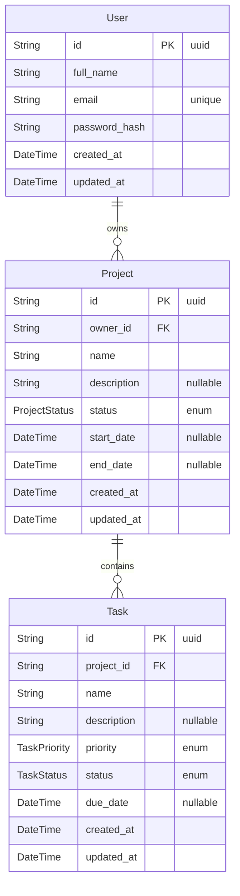

# TaskFlow Database Entity-Relationship Diagram

This document contains the Entity-Relationship Diagram for the TaskFlow PostgreSQL database, designed with Prisma ORM.

## Entity-Relationship Diagram

## Enumerations

**ProjectStatus**
- `NOT_STARTED`
- `IN_PROGRESS`
- `COMPLETED`

**TaskStatus**
- `PENDING`
- `IN_PROGRESS`
- `COMPLETED`

**TaskPriority**
- `LOW`
- `MEDIUM`
- `HIGH`
